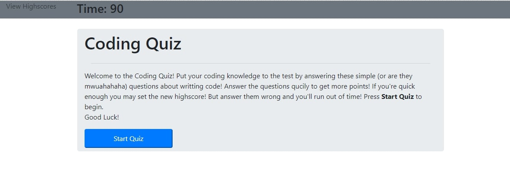
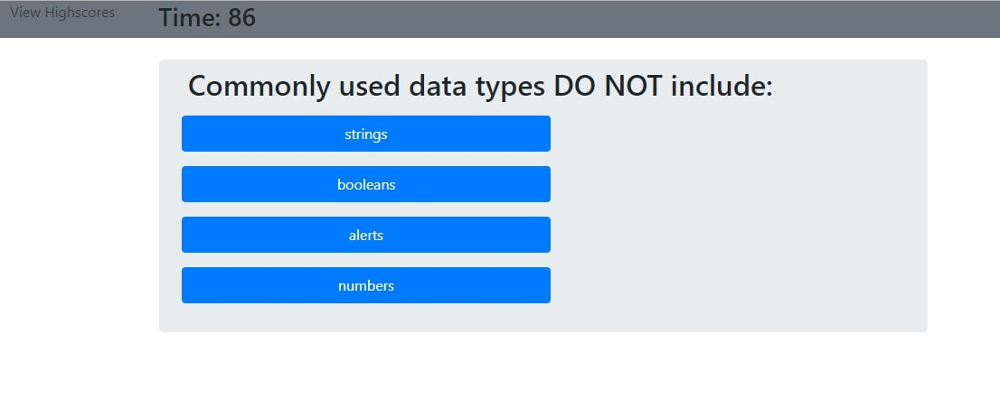
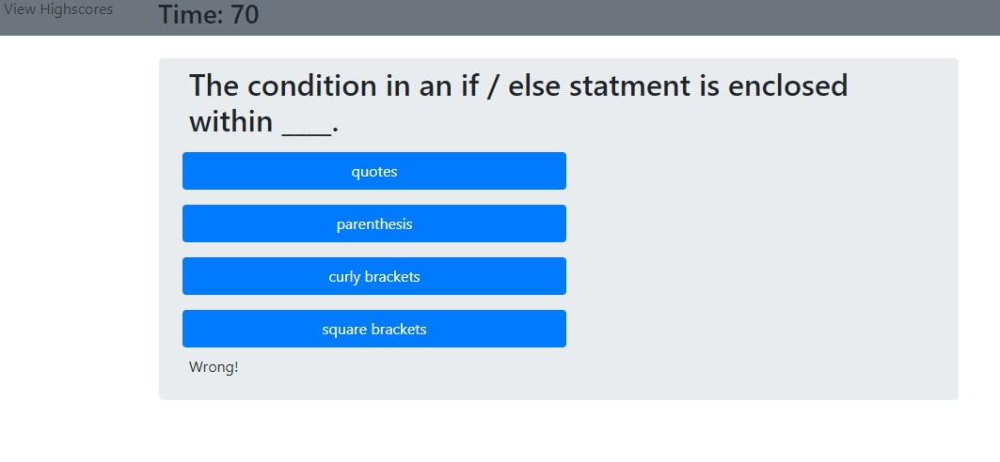
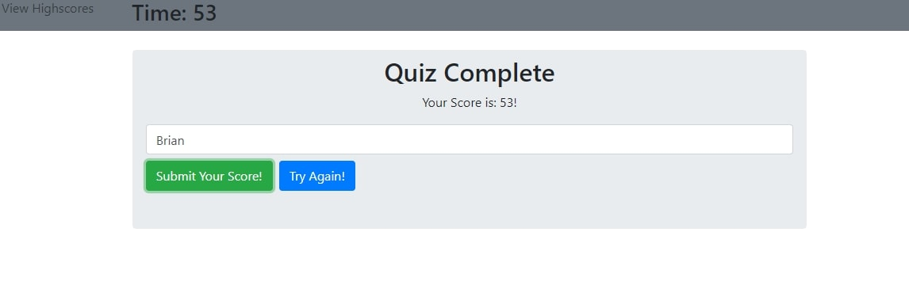

# Coding Quiz
## Description : 
A web based coding quiz built using native Javascript, HTML, and Bootstrap. 
   ```
As a coding bootcamp student,
I want to take a timed quiz on JavaScript fundamentals that stores high scores,
so that I can gauge my progress compared to my peers.
```

## Technologies :
* Javascript (native)
* HTML
* Bootstrap

---
## How it Works :

The user is welcomed by the home screen. The timer starts at 90 seconds and begins when the user clicks  the "Start Quiz" button. 



As the user progresses through the quiz, they'll be asked a series of multiple choice questions.



If the user gets the questions correct, the are free to move one to the next question without penalty, but if they answer incorrectly, 15 seconds is deducted from the timer. 



At the end of the quiz, the user's score correlates to the total time remaining on the clock upon completion. The user is then given the option to submit their score or try the quiz again.



If the user selects to "Submit Your Score!", then the users score is stored as JSON within the localStorage of the browser. 


